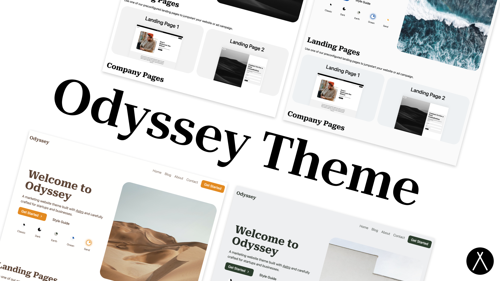

# TODO
- update logo.astro in /themes/src/components to an image
- get favicon working

## Template and Theme Credit

Thanks to Jaydan Urwin for the theme used in this website.

If you find this theme useful, please consider donating to support the continued development of it with the link below

[Donate to Odyssey Theme](https://littlesticks.lemonsqueezy.com/checkout?cart=1b9b09ef-0511-41ca-b94e-d6c6c4fde36e)

  

 

  
  
  
  

 
